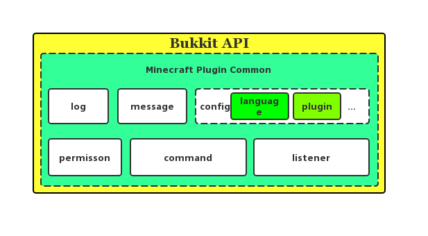

# Minecraft Plugin Common

## English
## Introduction

&nbsp;&nbsp;&nbsp;&nbsp;Machine translation may not be accurate.

&nbsp;&nbsp;&nbsp;&nbsp;Pub Description: {Bukkit Game Version}-v{Common Version}, please check the prefix version when using.

&nbsp;&nbsp;&nbsp;&nbsp;This framework is based on Bukkit's API development. It is a lazy component that I packaged according to my own code habits. The purpose is to develop my world bukkit server plugin faster and more conveniently. .

## Composition

&nbsp;&nbsp;&nbsp;&nbsp;The core components of the current release are:

	1: LogLogService, the console prints the log.
	2: The message MssageService sends a message to the player or the world.
	3: Configure ConfigService to conveniently load the files needed for the current internationalized language files and plug-ins to run.
	4: Command CommandService, used to monitor the commands entered by the player.
	5: The event listens to the Listener and listens to various events triggered by the player in the game.

## How to use

	1: clone git, compiled into a jar and placed in the plugin directory of the bukkit server.
	2: Refer to this project in your plugin project, inherit BasePlugin and start your plugin development journey

You need jdk1.8+ and maven.

	<dependency>
		<groupId>org.mountcloud</groupId>
		<artifactId>mc-plugin-common</artifactId>
		<version>1.13-R0.1-SNAPSHOT-v1.0</version>
		<scope>provided</scope>
	</dependency>

## Reference

&nbsp;&nbsp;&nbsp;&nbsp;This project was originally designed to make myself look even cooler, because I have a survival server, but I hope that I have a cooler title in front of me, and everyone can buy the title through virtual currency, however I didn't find a plugin that met my needs online, so I wrote it myself.

Title plugin GIT: [https://github.com/MountCloud/minecraft-plugin-prefix] (https://github.com/MountCloud/minecraft-plugin-prefix "https://github.com/MountCloud/minecraft- Plugin-prefix")

Title Plugin API GIT: [https://github.com/MountCloud/minecraft-plugin-prefix-api](https://github.com/MountCloud/minecraft-plugin-prefix-api "https://github.com /MountCloud/minecraft-plugin-prefix-api")

Title plugin store GIT: [https://github.com/MountCloud/minecraft-plugin-prefix-shop] (https://github.com/MountCloud/minecraft-plugin-prefix-shop "https://github.com /MountCloud/minecraft-plugin-prefix-shop")

## Play together

	QQ Group:828604217

## 中文

## 简介

&nbsp;&nbsp;&nbsp;&nbsp;版本说明：{Bukkit Game Version}-v{Common Version}，使用时请查看前缀版本。

&nbsp;&nbsp;&nbsp;&nbsp;这个框架基于的是Bukkit的API研发，是我根据我自己的代码习惯封装的一个懒人组件，目的就是为了更快捷、更方便的研发我的世界bukkit的服务器插件。

## 组成

&nbsp;&nbsp;&nbsp;&nbsp;当前版本核心组成部分为：
	
	1：日志LogService，控制台打印日志。
	2：消息MssageService，给玩家或者世界发送消息。
	3：配置ConfigService，便捷加载当前国际化语言文件与插件运行所需的文件。
	4：命令CommandService，用来监听玩家输入的命令。
	5：事件监听Listener，监听游戏中玩家触发的各种事件。

## 使用方式

	1：clone这个git，在编译成jar后放到bukkit server的plugin目录中。
	2：在你的插件项目中引用这个项目，继承BasePlugin开始你的插件研发之旅

你需要jdk1.8+与maven。

	<dependency>
		<groupId>org.mountcloud</groupId>
		<artifactId>mc-plugin-common</artifactId>
		<version>1.13-R0.1-SNAPSHOT-v1.0</version>
		<scope>provided</scope>
	</dependency>

## 参考

&nbsp;&nbsp;&nbsp;&nbsp;这个项目最初是为了满足我自己装波的想法，因为我有个生存服务器，但是我希望我前面有个更酷的称号，并且人人都可以通过虚拟币来购买称号，然而我再网上并没有找到满足我需求的插件，于是我就自己动手写了。

称号插件GIT：[https://github.com/MountCloud/minecraft-plugin-prefix](https://github.com/MountCloud/minecraft-plugin-prefix "https://github.com/MountCloud/minecraft-plugin-prefix")

称号插件API GIT：[https://github.com/MountCloud/minecraft-plugin-prefix-api](https://github.com/MountCloud/minecraft-plugin-prefix-api "https://github.com/MountCloud/minecraft-plugin-prefix-api")

称号插件商店GIT：[https://github.com/MountCloud/minecraft-plugin-prefix-shop](https://github.com/MountCloud/minecraft-plugin-prefix-shop "https://github.com/MountCloud/minecraft-plugin-prefix-shop")

## 一起游戏

	QQ群:828604217